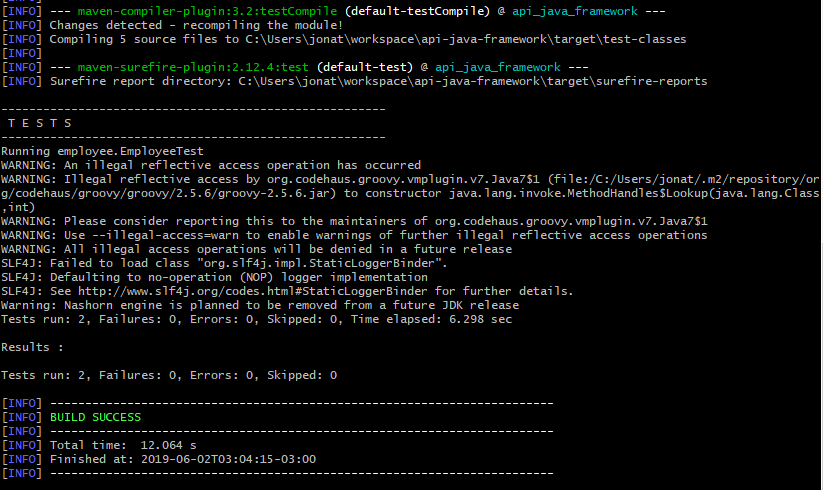

# API Testing Java Framework
> A test automation framework for APIs.

The purpose of this project is to demonstrate how to automate API tests using Java, REST-assured and the approach of Object Mother.

## Requirements

* [Java 11 JDK](https://www.oracle.com/technetwork/java/javase/downloads/jdk11-downloads-5066655.html)
* _IDE for Java development_ [IntelliJ](https://www.jetbrains.com/idea/)
* [Maven 3.6 or superior](https://maven.apache.org/)
* Environment variables in your Operational System:
	* PATH: The path of maven folder + _/bin_

## Project Structure

```
api_java_framework
	src.test.java
		employee
			entities
			    EmployeeEntity
			mother
			    EmployeeMother
			schema
			    post-employee.json
			EmployeeTest.java
		health_checks
		    HealthChecks.java
		Utils
		    Utils.java
```

* The _employee_ is an endpoint of API under testing.

* The _entities_ package contains classes that represent the object retrieved to the API.

* _mother_ package contains classes that create objects setting test data in order to cover the test scenarios.

* _schema_ contains the schema for test of contract.

* _EmployeeTest.java_ is the test of endpoint.

* The _health_checks_ package contains a class for verification of active endpoints before running the entire set of tests.

* _Utils_ contains common settings such as the base uri.

## Test setup

Once you have the required tools installed, you may run the automation through the IDE by selecting the test package and clicking the option Run.
You may also run just one test case by going to the test class and then clicking the Run option.

However, when you run the tests continuously, call them via command line by the _test_ maven task in the project directory.

```sh
mvn test
```

Your should see a log like this:




## Meta

Jonatas Kirsch – [Linkedin](https://linkedin.com/in/jonataskirsch)


## Contributing

1. Fork it (<https://github.com/jonatask/api-java-framework/fork>)
2. Create your feature branch (`git checkout -b feature/fooBar`)
3. Commit your changes (`git commit -am 'Add some fooBar'`)
4. Push to the branch (`git push origin feature/fooBar`)
5. Create a new Pull Request
